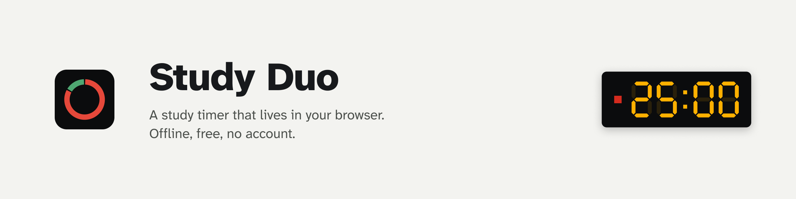

<picture>
  <source media="(prefers-color-scheme: dark)" srcset="docs/media/banner-dark.png">
  
</picture>

A free study timer that lives in your browser.

It shows a small digital clock in the corner of every page, keeps distracting websites closed while you study, rings a soft bell when it's time for a break, and over a few weeks learns which hours and which music help you focus best. No account. Works without internet. Everything stays on your computer.

> **Not ready yet.** Study Duo is still being built. The steps below will work as soon as the first version is out.

## Get Study Duo (about 2 minutes)

**The easy way:** open **[coflazo.github.io/study-duo](https://coflazo.github.io/study-duo)**. It shows the right line for your computer with a copy button. Then do step 3 below.

**Or do it from here:**

**1. Open the Terminal app.** It's already on your computer.

- Mac: press `⌘ Command` + `Space`, type **Terminal**, press Enter.
- Windows: press the `Windows` key, type **PowerShell**, press Enter.
- Linux: press `Ctrl` + `Alt` + `T`.

**2. Copy your line, paste it into the Terminal, press Enter.** Click the copy icon at the right edge of the box to copy it.

On a Mac or Linux:

```sh
curl -fsSL https://raw.githubusercontent.com/Coflazo/study-duo/main/install.sh | sh
```

On Windows:

```powershell
powershell -c "irm https://raw.githubusercontent.com/Coflazo/study-duo/main/install.ps1 | iex"
```

It downloads Study Duo, checks that the download isn't damaged, puts it in a folder on your computer, and opens your browser's extensions page.

**3. Three clicks in your browser.** Browsers ask you to approve extensions that don't come from their store, so:

1. Switch on **Developer mode** (top right corner).
2. Click **Load unpacked**.
3. Paste (`⌘ Command` + `V` on a Mac, `Ctrl` + `V` on Windows) and press Enter. The folder address is already copied for you.

That's it. Click the puzzle piece next to the address bar and pin Study Duo so its timer is always in sight.

Works in Chrome, Edge, Brave, Arc, Opera and Vivaldi. Firefox is coming later.

**Getting a newer version:** paste the same line again, then click the round arrow on the Study Duo card in your extensions page. Your history stays.

**Removing it:** click **Remove** on the Study Duo card in your extensions page.

## What it does

- **Timer:** 25 minutes of study, 5 minutes of break, a longer break every fourth round. Change any of it.
- **Corner clock:** a small old-school digital clock on every page. It fades out of your way and comes back when your mouse gets close. Hide it any time.
- **Time on the icon:** the minutes left show on the toolbar icon.
- **Bell and big words:** a soft bell and a short line like "Break's over" in the middle of the screen when a block starts or ends.
- **Website lock:** during study time, chosen sites stay closed. Or allow only the sites you need, plus your music.
- **To-do list:** pick what you're working on before you start.
- **Music:** it notices what's playing on YouTube Music, Spotify, Apple Music or SoundCloud in your browser, and it can play songs you've downloaded, even offline.
- **Calendar:** every study block and break is saved to a timeline you can export to any calendar app. Google Calendar sync is optional.
- **Your best hours:** after a few weeks it shows which hours of which days you focus best, and which music helps you most.

## Is it safe?

Study Duo has no servers and no account, and it sends nothing about you anywhere. Your history stays in your browser on your computer, and you can delete all of it with one button. The code is public, so anyone can check it.

<details>
<summary>What Study Duo stores, and what the optional connections send</summary>

Stored on your computer only: your settings, to-do list, study and break sessions, focus ratings, the songs that played, and how much time you spent on each website (just the site name, like youtube.com, never the pages you read).

Optional connections, off until you turn them on:

| Connection | What is sent, and to whom |
|---|---|
| Google Calendar | Start and end times of your sessions, into a separate "Study Duo" calendar in your own Google account |
| Last.fm or ListenBrainz | A request for your own recent songs, to that service |
| Deadline feed | A request for the calendar link you paste, for example from Canvas |

With all of them off, Study Duo makes no internet requests at all. Full details: [PRIVACY.md](PRIVACY.md).

</details>

<details>
<summary>Why it asks for each permission</summary>

| Permission | Why |
|---|---|
| Read and change data on all websites | To draw the clock and the big words on the page you're on. That part does nothing else. |
| Storage | To keep your settings and history on your computer |
| Alarms, idle | To end blocks on time and pause when you walk away |
| Notifications | To tell you a block ended when the browser is in the background |
| Offscreen (Chrome) | To play the bell and your music when the Study Duo window is closed |

Connections ask for their own permission only when you switch them on.

</details>

<details>
<summary>How "your best hours" works</summary>

After each study block you can rate your focus from 1 to 5 with one click. Study Duo puts those ratings next to the time of day, the day of the week, the music that played, and how much time went to distracting sites. A small piece of statistics on your own computer then works out what goes with your best focus.

Monday to Friday are treated as one group and Saturday and Sunday as another, so a day with only a few sessions can borrow from similar days. It only shows a pattern when it has enough of your sessions to back it up, and it tells you how sure it is. Expect the first results after about three weeks.

</details>

<details>
<summary>The research behind the default settings</summary>

- Fixed breaks leave students less tired than breaks they time themselves: [Biwer et al., 2023](https://pubmed.ncbi.nlm.nih.gov/36859717/).
- Spending a break on your phone makes the next study block worse: [Kang & Kurtzberg, 2019](https://pmc.ncbi.nlm.nih.gov/articles/PMC7044622).
- Songs with lyrics get in the way of reading more than instrumental music: [Vasilev, Kirkby & Angele, 2018](https://doi.org/10.1177/1745691617747398).
- A ten-second pause before opening a distracting site makes people open it less: [Grüning et al., 2023](https://pmc.ncbi.nlm.nih.gov/articles/PMC9974409).
- Writing down your progress helps you reach your goals: [Harkin et al., 2016](https://eprints.whiterose.ac.uk/91437/).

</details>

<details>
<summary>Prefer to install by hand, or want to read the install script first?</summary>

Read [install.sh](install.sh) (Mac, Linux) or [install.ps1](install.ps1) (Windows) before running them. To skip the Terminal completely: download the latest zip from [Releases](https://github.com/Coflazo/study-duo/releases), unzip it, then do step 3 above and choose the unzipped folder. The `SHA256SUMS` file next to the zip lets you check the download.

</details>

<details>
<summary>For developers</summary>

You need Node.js 22 or newer.

```sh
git clone https://github.com/Coflazo/study-duo && cd study-duo && npm ci && npm run dev
```

`npm test` runs the unit tests, `npm run test:e2e` runs the browser test, `npm run build` writes the extension to `build/chrome-mv3`. The design spec is in [docs/superpowers/specs](docs/superpowers/specs/2026-10-07-study-duo-design.md).

</details>

## Credits and license

Fonts, sounds and borrowed code are credited in [CREDITS.md](CREDITS.md) once they're added. Found a security problem? See [SECURITY.md](SECURITY.md). Study Duo is free and open source under the [MIT license](LICENSE).
