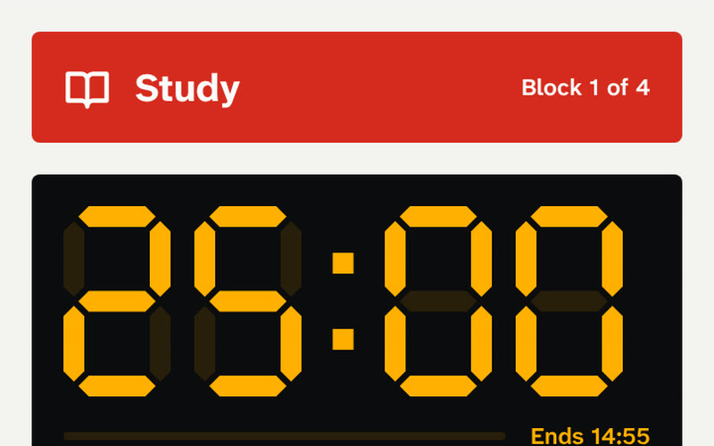
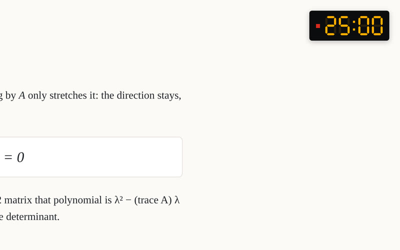
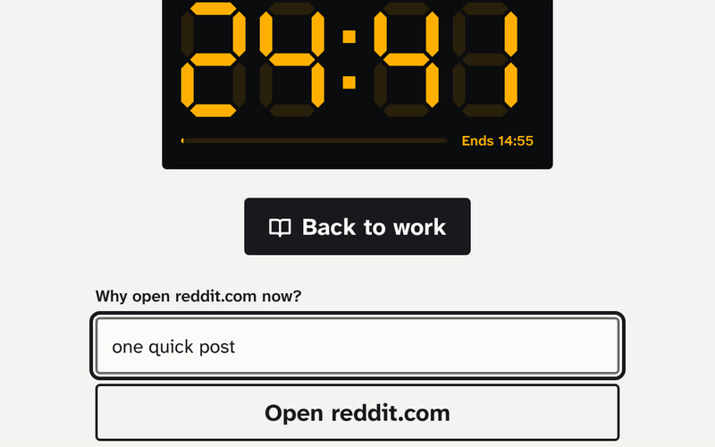
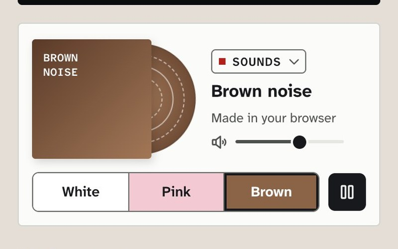
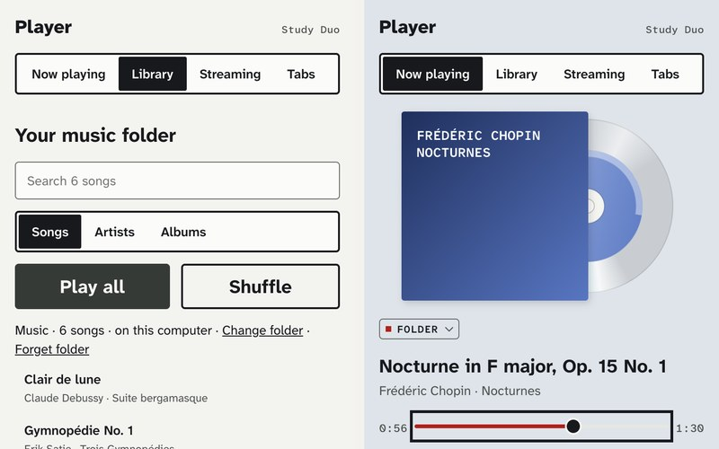
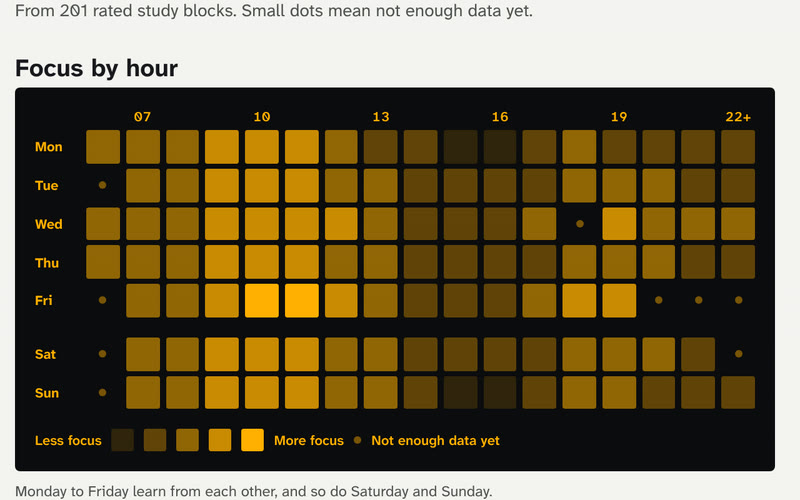
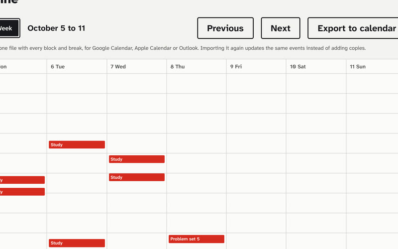

<picture>
  <source media="(prefers-color-scheme: dark)" srcset="docs/media/banner-dark.png">
  
</picture>

<p align="center">
  <a href="#get-study-duo">Install</a> ·
  <a href="PRIVACY.md">Privacy</a> ·
  <a href="CHANGELOG.md">Changelog</a> ·
  <a href="https://github.com/Coflazo/study-duo/releases">Releases</a>
</p>

<a href="docs/media/study-duo.mp4"></a>

A free study timer that lives in your browser. It keeps a small clock in the corner of every page, keeps distracting sites closed while you study, rings a bell when it's time for a break, and over a few weeks learns which hours and which music help you focus. No account. Works offline. Everything stays on your computer.

## What it does

| | |
|---|---|
|  | **Timer.** 25 minutes of study, 5 of break, a longer break every fourth round. Deadlines from your course calendar show up as to-dos. |
|  | **Corner clock.** A small clock on every page that fades while you read and comes back when your mouse gets close. |
|  | **Site lock.** Chosen sites stay closed until the block ends. Opening one anyway takes ten seconds and a reason. |
|  | **Player.** A record player under the timer: white, pink or brown noise made in the browser, your music folder, a YouTube, Spotify, SoundCloud, Apple Music or Tidal link, or the music already playing in a tab. One plays at a time, and switching fades one out and the next in. |
|  | **Side panel.** The full player beside the page: your folder's library by song, artist or album, the queue, shuffle and repeat, and streaming links in each service's own player. |
|  | **Your best hours.** Rate each block with one tap. After a few weeks it shows your best hours and which music helps. |
|  | **Timeline and calendar.** Every block and break on a week view. Connect Google Calendar and each one goes into a Study Duo calendar by itself, or export one file for any calendar app. |

Also: the minutes left on the toolbar icon, a bell and a short line in the middle of the page when a block starts or ends, songs from your phone through ListenBrainz or Last.fm, and moving your settings and to-dos to another computer with a file or QR codes.

## How it compares

Measured on 9 October 2026: each extension alone in a fresh browser, free version, default settings, no sign-in. [Full results and method](bench/results/2026-10-09.md).

| | Download | Script added to every page | CPU per idle minute | Outside servers contacted on install | Account needed to install |
|---|---|---|---|---|---|
| Study Duo 0.3.0 | 332 KB | 59 KB | 0.13 s, block running | 0 | No |
| LeechBlock NG 1.7.3 | 425 KB | 5 KB | 0.33 s | 0 | No |
| Forest 6.5.0 | 14.2 MB | 309 KB | 0.10 s | 0 | No |
| Focus To-Do 7.1.1 | 26.1 MB | 0 KB | below the noise | 0 | No |
| StayFocusd 4.6.15 | 10.3 MB | 7.0 MB | 0.71 s | 9 | No |
| BlockSite 7.1.1 | 18.8 MB | 6.7 MB | 0.50 s | 57 | No |

While a block runs, the dimmed corner clock shows minutes and wakes once a minute ([#41](https://github.com/Coflazo/study-duo/issues/41), [results](bench/results/2026-10-08-clock-fix.md)). The other rows are measured idle; Focus To-Do adds no script to pages and stays below the run-to-run noise.

## Get Study Duo

The easy way: open **[coflazo.github.io/study-duo](https://coflazo.github.io/study-duo)**, tick the browsers you want it in, and follow the page. It works out your computer, gives you one line to paste, shows a screenshot of each click, and tells you when Study Duo has arrived. About two minutes.

Or from here, on a Mac or Linux (name the browsers you use: chrome, edge, brave, arc, opera, vivaldi, firefox):

```sh
curl -fsSL https://raw.githubusercontent.com/Coflazo/study-duo/main/install.sh | sh -s -- --browsers chrome
```

On Windows, in PowerShell:

```powershell
powershell -c "& ([scriptblock]::Create((irm https://raw.githubusercontent.com/Coflazo/study-duo/main/install.ps1))) -Browsers chrome"
```

The line downloads Study Duo, checks that the download matches its checksum, puts it in a folder called Study Duo in your home folder, copies that folder's address, and opens each browser you named on its extensions page. Then, once per browser:

1. Switch on **Developer mode** (top right on most browsers, in the left column on Edge).
2. Click **Load unpacked**.
3. Paste the folder address and press Enter. On a Mac, press `⌘ Command` + `Shift` + `G` in that window first.

Click the puzzle piece next to the address bar and pin Study Duo so its timer is always in sight.

Why the clicks? Chrome and the browsers built on it let only you allow an extension from outside their store. No website or installer can switch on Developer mode for you, and none should.

**Firefox:** from 0.3.0, Mozilla signs Study Duo for Firefox without listing it in its store, so it installs from [the install page](https://coflazo.github.io/study-duo) with one click (Allow, then Add) and Firefox keeps it up to date by itself.

**Getting a newer version:** paste the same line again, then click the round arrow on the Study Duo card in your extensions page. Your history stays.

**Removing it:** click **Remove** on the Study Duo card in your extensions page, then delete the **Study Duo** folder in your home folder (or run the same line with `--uninstall` on a Mac or Linux, `-Uninstall` on Windows).

**Songs from desktop apps (optional):** Study Duo sees songs on music websites by itself. To count songs from desktop players too (Music, VLC, foobar2000 and others), add the small desktop helper by running the install line with `--helper`:

```sh
curl -fsSL https://raw.githubusercontent.com/Coflazo/study-duo/main/install.sh | sh -s -- --helper
```

On Windows:

```powershell
powershell -c "& ([scriptblock]::Create((irm https://raw.githubusercontent.com/Coflazo/study-duo/main/install.ps1))) -Helper"
```

Then turn on **Desktop apps** in Study Duo's Connections. The helper is a short script you can read first ([helper/](helper/)); it only reports the song title, artist, album and app, and only to Study Duo. `--uninstall` removes it too.

## How your best hours are worked out

Everything happens on your computer. After each study block you rate your focus from 1 to 5 with one tap, or skip it. Study Duo learns which hours, days and music go with your better blocks.

- **It waits for enough data.** Nothing shows until 25 rated blocks, and each hour only lights up once there are blocks near it. Until then you see how far along it is.
- **It only claims what it can back.** A best time or a music effect appears only when the data clearly supports it. Otherwise it says "unclear" or "no clear best time".
- **Weekdays learn from each other, and so do weekends.** A day with few blocks borrows from the days like it, so one odd Tuesday doesn't redraw your map.
- **Your quiet signals can stand in for a rating.** Once they predict your ratings well (after 15 rated blocks), time on study sites and how often you wander off fill in the blocks you didn't rate, and Study Duo asks less.
- **It suggests things to try.** A sound and a block length, picked to keep learning what works for you.
- **Spotify's web player doesn't count.** Spotify's rules forbid feeding what it plays into a model like this one, so those songs show in Music and the timeline but stay out of your insights.

<details>
<summary>The details, for the curious</summary>

- The model is a Bayesian linear regression with grouped Gaussian priors, fitted in the browser with a Cholesky factorisation and no extra code libraries. Each group's prior strength and the noise level are set by evidence maximisation (MacKay's fixed point).
- Time is modelled as an hour-of-day profile, plus a weekday or weekend difference, plus a per-day difference in three-hour steps. The hour effects are coded as steps from one hour to the next, so the prior is a random walk along the day.
- Music effects nest: genre, then artist, then track, each a share of the block's minutes, compared with silence.
- A music effect is claimed when its 80% interval excludes zero and it is at least a quarter of a rating point. A best window must beat your usual hours at a one-sided 97.5% bound, because it is the best of about 14 candidates.
- Suggestions come from Thompson sampling: one draw from the model's uncertainty, so options it is unsure about still get tried.
- The model is checked on simulated students with known answers (it must find their best hours and the effect of songs with lyrics, call a song with no effect unclear, and claim nothing for students whose ratings are pure noise) and, on your data, by predicting each block from the ones before it.

</details>

## Is it safe?

Study Duo has no servers and no account. Your history stays in your browser on your computer, and you can delete all of it with one button. Unless you switch on a connection, it sends nothing anywhere; a connection asks one service for your own data and nothing more. The code is public, so anyone can check it.

<details>
<summary>What Study Duo stores, and what the optional connections send</summary>

Stored on your computer only: your settings, to-do list, study and break sessions, focus ratings, the songs that played, and how much time you spent on each website (just the site name, like youtube.com, never the pages you read).

Optional connections, each off until you turn it on in Connections:

| Connection | What is sent, and to whom |
|---|---|
| Course deadlines | A request for the calendar link you paste (for example from Canvas), to the site that hosts it, every 6 hours |
| ListenBrainz or Last.fm | A request for your own recent songs, to that service, every 30 minutes (Last.fm also gets your API key) |
| Google Calendar | Each study block and break as an event in a separate "Study Duo" calendar in your own Google account: times, task, focus rating, and (unless you switch it off) the study sites and songs |

With all of them off, Study Duo makes no internet requests at all: one small part of the code makes every request, and it refuses any address that isn't a connection you switched on. Full details: [PRIVACY.md](PRIVACY.md).

</details>

<details>
<summary>Why it asks for each permission</summary>

| Permission | Why |
|---|---|
| Read and change data on all websites | To draw the clock and the big words on the page you're on, close blocked sites during a study block, note the site name of the page in front, read what's playing on music sites, and, only if you turn it on, count keys, clicks and scrolls. It never reads page text or what you type. |
| Storage | To keep your settings and history on your computer |
| Alarms, idle | To end blocks on time and pause when you walk away |
| Notifications | To tell you a block ended when the browser is in the background |
| Offscreen (Chrome) | To play the bell and your music when the Study Duo window is closed |

Study Duo is switched off in private (Incognito) windows, so nothing from them is recorded.

</details>

<details>
<summary>The research behind the default settings</summary>

- Fixed breaks leave students less tired than breaks they time themselves: [Biwer et al., 2023](https://pubmed.ncbi.nlm.nih.gov/36859717/).
- Spending a break on your phone makes the next study block worse: [Kang & Kurtzberg, 2019](https://pmc.ncbi.nlm.nih.gov/articles/PMC7044622).
- Songs with lyrics get in the way of reading more than instrumental music: [Vasilev, Kirkby & Angele, 2018](https://doi.org/10.1177/1745691617747398).
- A ten-second pause before opening a distracting site makes people open it less: [Grüning et al., 2023](https://pmc.ncbi.nlm.nih.gov/articles/PMC9974409).
- Writing down your progress helps you reach your goals: [Harkin et al., 2016](https://eprints.whiterose.ac.uk/91437/).

</details>

<details>
<summary>Prefer to install by hand, or want to read the install script first?</summary>

Read [install.sh](install.sh) (Mac, Linux) or [install.ps1](install.ps1) (Windows) before running them. To skip the Terminal completely: download `study-duo-chromium.zip` from the [latest release](https://github.com/Coflazo/study-duo/releases/latest), unzip it, then do step 3 above and choose the unzipped folder.

To check the download yourself, compare its checksum with the `SHA256SUMS` file next to it:

```sh
shasum -a 256 study-duo-chromium.zip          # Mac, Linux
Get-FileHash study-duo-chromium.zip           # Windows PowerShell
```

GitHub Actions built every zip from this repository's source and signed a record of that. With the [GitHub CLI](https://cli.github.com) you can check it: `gh attestation verify study-duo-chromium.zip --repo Coflazo/study-duo`. The installers do this for you when `gh` is installed and signed in.

</details>

<details>
<summary>For developers</summary>

You need Node.js 22 or newer.

```sh
git clone https://github.com/Coflazo/study-duo && cd study-duo && npm ci && npm run dev
```

`npm test` runs the unit tests, `npm run test:e2e` runs the browser test, `npm run build` writes the extension to `build/chrome-mv3`. The design spec is in [docs/superpowers/specs](docs/superpowers/specs/2026-10-07-study-duo-design.md).

</details>

## Credits and license

Fonts, music, the film's voice and borrowed code are credited in [CREDITS.md](CREDITS.md). The film is rebuilt from the real extension by [demo/](demo/). Found a security problem? See [SECURITY.md](SECURITY.md). Study Duo is free and open source under the [MIT license](LICENSE).
